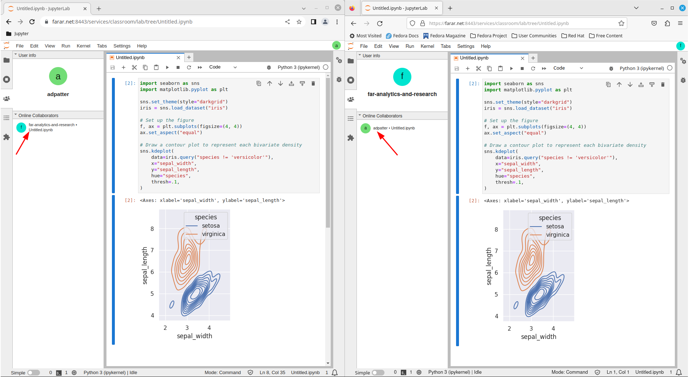

# A Containerized Collaborative JupyterHub Implementation 

## Introduction

This repository contains instructions for building a Docker image that can be ran in a container that exposes an instance of JupyterHub on port 8443 that redirects users to a collaborative instance of JupyterLab.  

A single JupyterLab instance is started as a JupyterHub managed service.  When a user authenticates the user is redirected to the JupyterHub managed JupyterLab service, as opposed to being redirected to their own instance.  

This implementation could be used for tutoring or collaborative "office hours".

The configuration assumes GitHub OAuth.  

## Warning

JupyterLab permits remote data access and remote code execution.  Security should be implemented in accordance with your requirements.  

##  Usage

### SSL Certificates

Copy the SSL certificate file for your domain to `./secrets/ssl.crt`.

Copy the SSL key file for your domain to `./secrets/ssl.key`.

### Configuration

Copy the `./jupyterhub_config_example.py` file to `./jupyterhub_config.py`.  Open the configuration file in an editor.

#### Add a list of GitHub users to the USERS list.

The GitHub users in this list will be allowed to authenticate with the GitHub Authenticator i.e., `c.Authenticator.allowed_users = USERS`.

For example:

```py
USERS = ["a-github-user-name", "another-github-user-name"]
```

#### Configure [OAuth](https://jupyterhub.readthedocs.io/en/stable/howto/configuration/config-ghoauth.html).

```py
c.GitHubOAuthenticator.oauth_callback_url = ""
c.GitHubOAuthenticator.client_id = ""
c.GitHubOAuthenticator.client_secret = ""
```

### Build the Image

```bash
docker build --build-arg CACHE_INVALIDATE=$(date +%s) -t collaborative_jupyterlab .
```

### Run the Image in a Container

```bash
docker run -p 8443:8443 collaborative_jupyterlab
```

### Authenticate and Collaborate

```
https://example.com:8443
```



## References

https://github.com/jupyterhub/jupyterhub/tree/4.0.0/examples/service-notebook

https://jupyterhub.readthedocs.io/en/stable/reference/services.html

https://jupyterhub.readthedocs.io/en/stable/rbac/index.html

https://jupyterhub.readthedocs.io/en/stable/reference/config-reference.html

## Aspirations

Configure iptables/nftables in order to prevent outgoing connections.